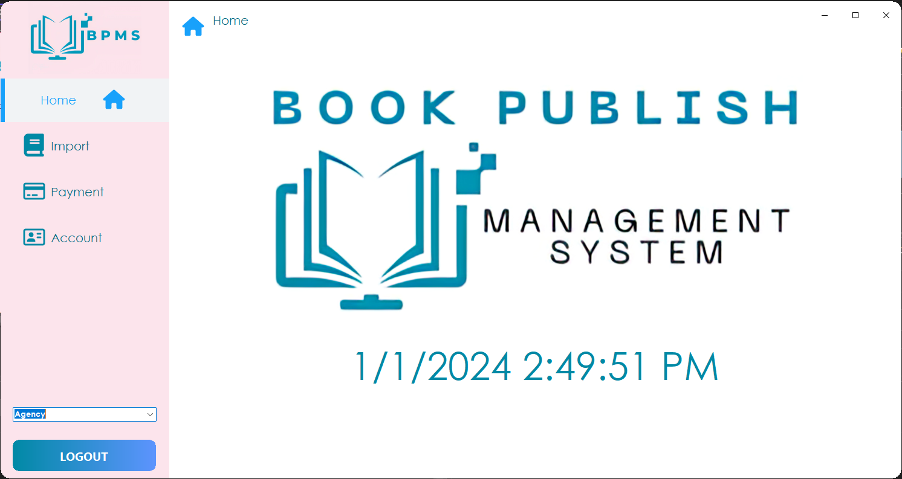

<!-- PROJECT LOGO -->

  

  <h3 align="center">Ứng dụng Quản lý phát hành sách - Book Publish Management System</h3>

  

    Đây là 1 ứng dụng quản lý công việc phân phối phát hành sách chạy trên hệ điều hành window, sử dụng .NET WindowForm để xây dựng !
     
    <a href="https://github.com/AndrewNguyen-05/BPMS"><strong>Khám phá ứng dụng này »</strong></a>
     
     
    <a href="https://github.com/AndrewNguyen-05/BPMS">Xem demo</a>
    ·
    <a href="https://github.com/AndrewNguyen-05/BPMS/issues">Báo lỗi</a>
    ·
    <a href="https://github.com/AndrewNguyen-05/BPMS/issues">Yêu cầu tính năng</a>
  

<!-- TABLE OF CONTENTS -->

  
Nội dung

  <ol>
    <li>
      <a href="#about-the-project">Về ứng dụng này</a>
      <ul>
        <li><a href="#built-with">Xây dựng với</a></li>
      </ul>
    </li>
    <li>
      <a href="#getting-started">Bắt đầu sử dụng</a>
      <ul>
        <li><a href="#installation">Cài đặt</a></li>
      </ul>
    </li>
    <li><a href="#usage">Hướng dẫn sử dụng</a></li>
    <li><a href="#contact">Liên hệ</a></li>
    <li><a href="#acknowledgments">Nguồn tham khảo</a></li>
  </ol>

<!-- ABOUT THE PROJECT -->

## Về ứng dụng này

<i>Ứng dụng quản lý phát hành sách</i>

Ứng dụng Quản lý Phát hành Sách là một công cụ hiệu quả giúp các đối tác trong ngành xuất bản quản lý quá trình xuất nhập sách một cách linh hoạt và hiệu quả. Được thiết kế để đáp ứng nhu cầu đặc biệt của nhà xuất bản, đại lý và quản lý, ứng dụng này đóng vai trò quan trọng trong quá trình phân phối sách từ nhà xuất bản đến đại lý và ngược lại.

Dưới đây là mô tả chi tiết về các tính năng chính của ứng dụng:

1. Quản Lý Xuất Sách và Nhập Sách
  * Nhà Xuất Bản - Xuất Sách:
    * Tạo danh sách sách cần xuất, đi kèm với thông tin chi tiết về từng cuốn sách.
    * Tổ chức lô sách và tạo mã vận đơn cho quá trình vận chuyển.
  * Đại Lý - Nhập Sách:
    * Nhận sách theo đợt và cập nhật tình trạng nhập kho một cách tự động.
    * Xác nhận số lượng sách và thông tin vận đơn.
2. Quản Lý Đơn Đặt Hàng
  * Tạo Đơn Đặt Hàng:
    * Quản lý đơn đặt hàng từ đại lý, đi kèm với thông tin chi tiết về sách và số lượng.
    * Xác nhận và tổ chức đơn để dễ dàng theo dõi tình trạng vận chuyển.
3. Giao Diện Quản Lý
  * Dashboard Quản Lý:
    * Cung cấp cái nhìn tổng quan về tình trạng xuất nhập sách và đơn đặt hàng.
    * Thống kê về số lượng sách xuất, nhập và tồn kho.
4. Quản Lý Tài Khoản và Đổi Mật Khẩu
  * Quản Lý Tài Khoản:
    * Cho phép nhà xuất bản và đại lý quản lý thông tin cá nhân và tài khoản của họ.
    * Dễ dàng thêm, xóa và sửa đổi thông tin tài khoản.
5. Giao Diện Thống Kê
  * Thống Kê Doanh Thu:
    * Hiển thị doanh thu theo ngày, tháng và năm để quản lý thu nhập.
    * Cung cấp báo cáo chi tiết về hiệu suất xuất bản và phân phối sách.
6. Giao Diện Tài Khoản
  * Đổi Mật Khẩu:
    * Bảo vệ thông tin cá nhân với khả năng đổi mật khẩu định kỳ.
Ứng dụng Quản lý Phát hành Sách là một công cụ đa nhiệm linh hoạt, giúp tối ưu hóa quy trình xuất nhập sách và đồng thời mang lại sự tiện lợi cho nhà xuất bản, đại lý và quản lý trong ngành xuất bản.

(<a href="#readme-top">back to top</a>)

### Xây dựng với

### Frameworks và thư viện

    

<i>Những công nghệ sử dụng</i>

(<a href="#readme-top">back to top</a>)

<!-- GETTING STARTED -->

## Bắt đầu sử dụng
Hướng dẫn cách cài đặt dự án về máy. Để có một bản sao ứng dụng có thể chạy được, làm theo những bước đơn giản sau đây:

### Cài đặt

Để có thể chạy được ứng dụng, yêu cầu cài đặt những thứ sau:
* <a href="https://visualstudio.microsoft.com/downloads/">Visual Studio 2022</a>, Community Edition để chạy mã nguồn
* <a href="https://www.microsoft.com/en-us/sql-server/sql-server-downloads">SQL Server 2019</a>, Express Edition (Lưu ý, phải đúng phiên bản Express Edition)
* <a href="https://learn.microsoft.com/en-us/sql/ssms/download-sql-server-management-studio-ssms?view=sql-server-ver16">SMSS</a> để thao tác với database

1. Đầu tiên, hãy clone dự án này về máy và mở bằng Visual Studio 2022
2. Mở file BPMS.sql bằng SSMS, và nhấn F5 để SMSS chạy và tạo 1 database mới có tên là BPMS với đầy đủ dữ liệu
   
   
<i>Khởi chạy database</i>

4. Vì ứng dụng này sử dụng 1 số thư viện Nuget ngoài để chạy, phụ thuộc vào thời điểm clone ứng dụng mà các thư viện sẽ có những thay đổi khác nhau, dẫn đến lỗi. Để giải quyết:
    * Đầu tiên, hãy chuột phải vào solution BPMS và chọn vào mục Manage Nuget Packages
   
   
<i>Lưu ý cập nhật các thư viện nuget cho đồ án</i>

   
    * Sau đó, hãy trỏ vào mục Updates, nhấn chọn select all và cuối cùng là update các thư viện Nuget
   
   
<i>Cập nhật tất cả thư viện nuget</i>

5. Bây giờ ứng dụng đã có thể chạy được, chỉ cần ấn nút Start và ứng dụng sẽ được khởi chạy. Tài khoản mật khẩu cho admin là: Admin - AD, đối với đại lý, mật khẩu sẽ là DL, và nhà xuất bản mật khẩu sẽ là NXB.
   
   
<i>Danh sách tài khoản - mật khẩu hiện có trong hệ thống</i>

(<a href="#readme-top">back to top</a>)

<!-- USAGE EXAMPLES -->
## Hướng dẫn sử dụng

Có 6 màn hình bao gồm: màn hình chính, nhập sách, xuất sách, thanh toán, thống kê, tài khoản
1. Màn hình đăng nhập
   * Sử dụng tài khoản, mật khẩu đã được cung cấp để đăng nhập, có thể là admin hoặc nhân viên
   
   
<i>Màn hình đăng nhập ứng dụng</i>

   
2. Màn hình chính
   * Trong màn hình này sẽ hiển thị thông tin tên ứng dụng, cũng như logo 
   
   
<i>Trang chủ ứng dụng</i>

   
3. Màn hình nhập sách
   * Màn hình này sẽ giúp các đại lý có thể quản lý việc nhập sách dễ dàng hơn. Manager sẽ có thể tạo phiếu nhập dễ dàng, cũng như quản lý, xóa, sửa đổi các phiếu nhập đang có trong hệ thống.
   
   
<i>Màn hình hiển thị các phiếu nhập sách trong hệ thống</i>

   
   
   
<i>Màn hình tạo phiếu nhập sách</i>

   
   
   
<i>Màn hình chỉnh sửa phiếu nhập sách</i>

   
4. Màn hình Xuất sách
   * Tương tự như màn hình nhập sách, giao diện này giúp cho manager có thể quản lý việc phát hành sách của các nhà xuất bản dễ dàng hơn nhờ các thông tin chi tiết trong phiếu xuất sách
   
   
<i>Màn hình hiển thị các phiếu xuất sách trong hệ thống</i>

   
   
   
<i>Màn hình tạo phiếu xuất sách</i>

   
   
   
<i>Màn hình chỉnh sửa phiếu xuất sách</i>

   
5. Màn hình thanh toán
   * Giúp cho manager có thể quản lý những đơn hàng xuất, nhập sách, và quản lý các bill
   
   
<i>Màn hình thanh toán</i>
 
   
   
   
<i>Màn hình quản lý hóa đơn trong hệ thống</i>

   
6. Màn hình thống kê
   * Giúp cho manager có thể quản lý những đơn hàng, thống kê tiền ra tiền vào từ đó giúp cho việc kiểm soát tài chính trở nên dễ dàng. Ngoài ra cũng có thể theo dõi những đầu sách được nhập và xuất nhiều nhất, từ đó có thể đưa ra những nhận định, đánh giá phù hợp.
   
   
<i>Màn hình quản lý thống kê xuất sách</i>

   
   
   
<i>Màn hình quản lý thống kê nhập sách</i>

     
7. Màn hình tài khoản
   * Quản lý tài khoản các nhà xuất bản, đại lý, cũng như kế toán và admin trong hệ thống, có thể thêm xóa sửa tài khoản mới.
  
  
<i>Màn hình quản lý tài khoản trong hệ thống</i>

  
  
  
<i>Màn hình tạo tài khoản mới</i>

     
8. Các màn hình khác
  
  
<i>Giao diện dành cho kế toán</i>

  
     
  
<i>Giao diện dành cho nhà xuất bản - tạo sách mới</i>

  
  
<i>Giao diện dành cho đại lý</i>

(<a href="#readme-top">back to top</a>)

<!-- CONTACT -->
## Liên hệ

* Nguyễn Văn Hoàng Anh - [Facebook](https://www.facebook.com/andrew.nguyen0505/) - 21520144@gm.uit.edu.vn
* Hoàng Đức Mạnh - [Facebook](https://www.facebook.com/hoangducmanh254) - 21520062@gm.uit.edu.vn
* Trương Hoàng Bảo Duy - [Facebook](https://www.facebook.com/baoduy.truonghoang.581) - 21520789@gm.uit.edu.vn

Project Link: [BPMS](https://github.com/AndrewNguyen-05/BPMS)

(<a href="#readme-top">back to top</a>)

<!-- ACKNOWLEDGMENTS -->
## Nguồn tài liệu tham khảo

Đây là những nguồn tài liệu nhóm chúng mình đã sử dụng để có thể thực hiện được đồ án này!

* [Learn C#](https://learn.microsoft.com/vi-vn/dotnet/csharp/)
* [C# Tutorial by W3School](https://www.w3schools.com/cs/index.php)
* [Learn .NET](https://dotnet.microsoft.com/en-us/learn)
* [Learn Winform](https://learn.microsoft.com/vi-vn/dotnet/desktop/winforms/?view=netframeworkdesktop-4.8)
* [Winform](https://learn.microsoft.com/en-us/dotnet/desktop/winforms/getting-started-with-windows-forms?view=netframeworkdesktop-4.8)
* [Learn SQL](https://learn.microsoft.com/vi-vn/sql/sql-server/tutorials-for-sql-server-2016?view=sql-server-ver15)
* [SQL Tutorial by W3School](https://www.w3schools.com/sql/)

(<a href="#readme-top">back to top</a>)

